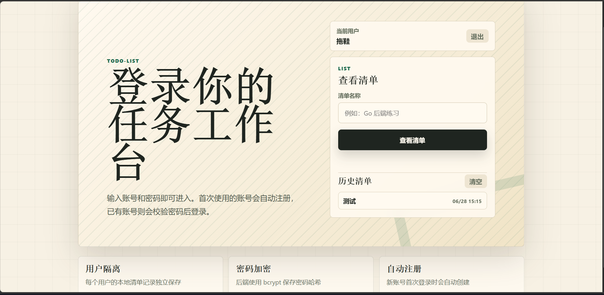
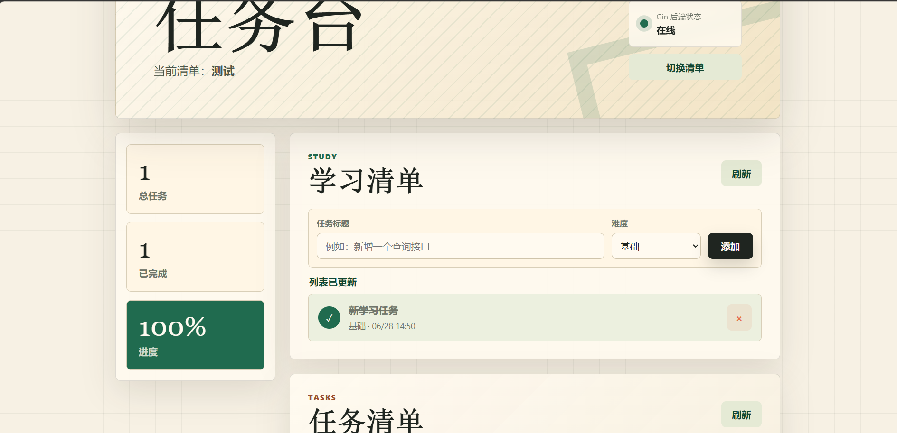

# 一间清单 Todo-list


一个用于学习 Gin 后端开发的多端任务清单项目。用户通过房间名称进入独立任务空间，管理「学习清单」和「任务清单」。

同一套 Gin API 同时支持浏览器端和微信小程序端。

如果这个项目对你学习 Gin、GORM、前后端分离或部署上线有帮助，欢迎点一个 Star。

## 在线访问

https://list.tuoxie.asia

同名小程序（一间清单）正在发布中。

## 预览







[查看动图演示](./media/todo-gif.gif)

## 功能

- 房间创建/进入
- 房间任务隔离
- 学习清单、任务清单管理
- 新增、完成/恢复、删除任务
- 浏览器端和小程序端历史房间记录
- YAML 配置端口和数据库连接

## 项目亮点

- 适合 Gin 初学者练习完整项目流程
- 浏览器端和小程序端共用同一套后端接口
- 包含配置管理、数据库关联、接口设计和部署实践

## 技术栈

- Backend：Go、Gin、GORM、MySQL
- Web：HTML、CSS、JavaScript
- Mini Program：微信小程序原生开发

## 目录

```text
backend/       Gin 后端
frontend/      浏览器端
miniprogram/   微信小程序端
config/        配置示例
```

## 快速启动

创建数据库：

```sql
CREATE DATABASE list DEFAULT CHARACTER SET utf8mb4 COLLATE utf8mb4_unicode_ci;
```

复制并配置 `config.yaml`：

```bash
cp config/config.example.yaml config/config.yaml
```

启动后端：

```bash
cd backend
go mod tidy
go run .
```

启动浏览器端：

```bash
cd frontend
node server.js
```

访问：

```text
http://localhost:18090
```

小程序端用微信开发者工具打开 `miniprogram/` 目录。

## API

```text
POST   /api/rooms
GET    /api/rooms/:roomID/tasks
POST   /api/rooms/:roomID/tasks
PATCH  /api/rooms/:roomID/tasks/:taskID/toggle
DELETE /api/rooms/:roomID/tasks/:taskID
```

`kind` 可选值：

```text
learning      学习清单
optimization 任务清单
```

## 测试和构建

```bash
cd backend
go test ./...
go build -buildvcs=false -o todo-list .
```

```bash
node --check frontend/server.js
node --check frontend/home.js
node --check frontend/app.js
```

## License

MIT License
